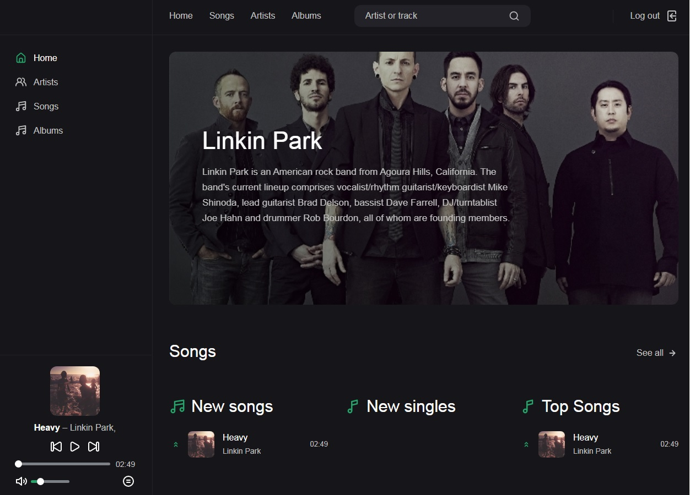

# NovaMusic-a-django-music-website
**NovaMusic** is a Django music website. <br>
Users can register and login. They cannot download songs or albums if they aren't authenticated. <br>
There are REST APIs in this project, so **admins** can use REST APIs to upload and download songs and albums. <br>
I used celery in this project, you will receive an email after submitting a comment. <br>
This project is connected to [Arvancloud](https://www.arvancloud.com/en) bucket, all files upload to the bucket. <br>
You can absolutly use [Amazon s3](https://aws.amazon.com/s3/pricing/) instead. 


## Environment
Create a file named `.env` in the directory and add all the variables there.
```
EMAIL = email@email.com
PASSWORD = emailpass
HOST = db host
NAME = db name
USER = db user
DB_PASSWORD = db pass
ACCESS_KEY_ID = storage access key id
SECRET_ACCESS_KEY = storage secret access key
STORAGE_BUCKET_NAME = storage bucket name
CELERY_BROKER_URL = redis broker url for celery
```

## Screenshots
You can see all screenshots [here](https://github.com/AnonC0DER/NovaMusic-a-django-music-website/tree/main/screenshots)

